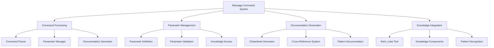
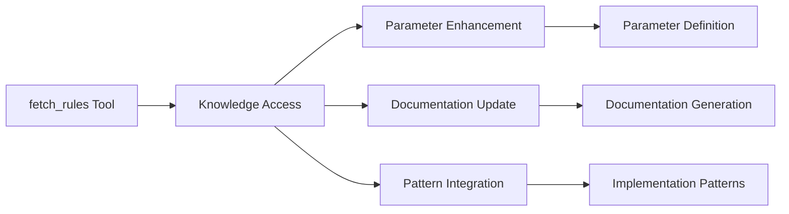
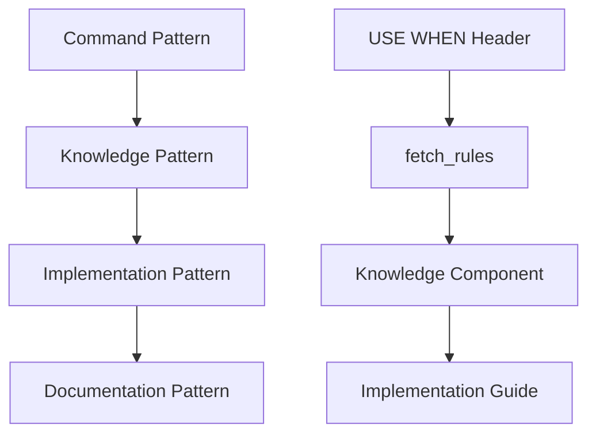

# Message Command System Enhancement

## Overview
This enhancement implements a comprehensive update to the message-command system, focusing on:
1. Parameter definition standardization with "USE WHEN" headers
2. Integration with Agent Requested rules through fetch_rules
3. Enhanced documentation and knowledge access
4. Improved script processing and validation
5. Visual architecture documentation
6. Comprehensive knowledge integration

## System Architecture

### Core Architecture


## Key Components

### 1. Parameter Definition System
- **Standardized Format**: Enhanced "USE WHEN" headers with knowledge integration
  ```markdown
  USE WHEN: [Primary Use Case]
  KNOWLEDGE: fetch_rules(["knowledge/path"])
  PATTERNS: [Related Patterns]
  REQUIRES: [Dependencies]
  ```
- **Knowledge Integration**: Direct connection with Agent Requested rules
- **Relationship Documentation**: Comprehensive parameter-knowledge mapping
- **Validation Rules**: Knowledge-aware validation system

### 2. Knowledge Integration System


### 3. Documentation System
- **Enhanced Format**: Knowledge-integrated documentation structure
- **Cross-References**: Complete knowledge relationship mapping
- **Pattern Documentation**: Comprehensive pattern library
- **Visual Documentation**: Mermaid diagrams for clarity

## Implementation Files

### Core Files
1. **Parameter Definition Files**
   ```typescript
   // Standard parameter with knowledge integration
   // parameters/standard/workflow-type.md
   USE WHEN: Defining workflow context
   KNOWLEDGE: fetch_rules(["knowledge/patterns/impl/workflow-types"])
   PATTERNS: Workflow Definition, Context Setting
   REQUIRES: Valid workflow type
   ```

2. **Script Files**
   ```powershell
   # Enhanced validation with knowledge integration
   function Test-KnowledgeIntegration {
       param (
           [string]$command,
           [string]$knowledgePath
       )
       # Validation logic with fetch_rules
   }
   ```

3. **Documentation Files**
   - Architecture mapping with visual diagrams
   - Cross-system patterns with knowledge integration
   - Comprehensive test suite with knowledge validation

## Knowledge Integration

### 1. Knowledge Access Patterns
```typescript
// Direct knowledge access
fetch_rules(["knowledge/patterns/impl/pattern-name"],
           "Understanding implementation patterns")

// Combined knowledge access
fetch_rules([
    "knowledge/patterns/tool/tool-patterns",
    "knowledge/reference/architecture"
], "Comprehensive pattern understanding")
```

### 2. Knowledge-Parameter Integration
```typescript
// Parameter with knowledge integration
workflow-type: rules-workflow
// USE WHEN: Defining rules workflow context
// KNOWLEDGE: fetch_rules(["knowledge/patterns/impl/workflow-types"])
// PATTERNS: Workflow Definition, Context Setting
// REQUIRES: Valid workflow type
```

### 3. Knowledge-Documentation Integration
```markdown
# Implementation Pattern
USE WHEN: Documenting implementation steps
KNOWLEDGE: fetch_rules(["knowledge/reference/guides/implementation"])
PATTERNS: Documentation, Knowledge Integration
REQUIRES: Valid implementation context
```

## Pattern Relationships

### 1. Command-Knowledge Matrix
| Command Type | Knowledge Component | Access Pattern |
|-------------|-------------------|----------------|
| Mode Transition | knowledge/patterns/tool/mode-transition | fetch_rules |
| Continuation | knowledge/patterns/tool/continuation | fetch_rules |
| Parameter Definition | knowledge/patterns/impl/parameter-standards | fetch_rules |

### 2. Knowledge Flow


## Success Criteria

### 1. System Integration
- ✓ Complete knowledge integration through fetch_rules
- ✓ Comprehensive parameter system with knowledge
- ✓ Enhanced documentation with pattern recognition
- ✓ Visual architecture documentation

### 2. Documentation Quality
- ✓ Clear and consistent documentation format
- ✓ Complete knowledge reference documentation
- ✓ Visual diagram integration
- ✓ Effective pattern documentation

### 3. Implementation Success
- ✓ Successful knowledge access through fetch_rules
- ✓ Proper parameter validation with knowledge
- ✓ Effective pattern recognition and application
- ✓ Comprehensive test coverage

## Next Steps

1. Review the enhanced implementation plan
2. Begin with knowledge integration setup
3. Follow the test-driven development approach
4. Maintain backward compatibility
5. Update visual documentation as needed 