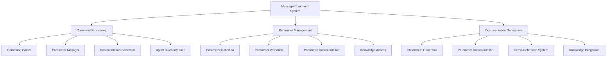
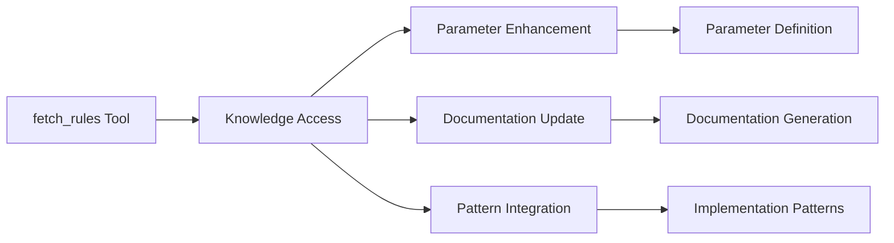
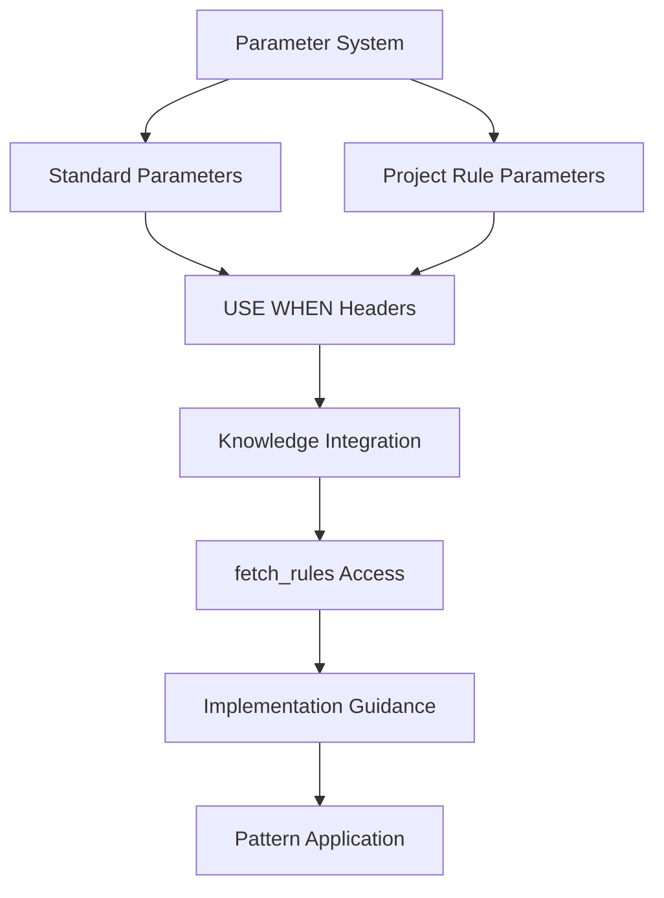

# Context Analysis: Message Command System Architecture

## Cognitive Architecture Overview

The message-command system is a core component of the PolygonExpress cognitive architecture, responsible for:
1. Structured communication between Tyler and 1000xdev
2. Mode management and transitions
3. Parameter handling and validation
4. Documentation generation and maintenance

## Core Subsystems

### 1. Message Command Processing
- **Command Parser**: Processes message-commands and their parameters
- **Parameter Manager**: Handles standard-parameters and project-rule-parameters
- **Documentation Generator**: Creates and updates cheatsheets and documentation
- **Agent Requested Rules Interface**: Manages access to specialized knowledge through fetch_rules

### 2. Parameter Management System
- **Parameter Definition System**: Standardized format with "USE WHEN" headers
- **Parameter Validation**: Validates parameter combinations and relationships
- **Parameter Documentation**: Maintains parameter documentation and cheatsheets
- **Agent Requested Knowledge Access**: Integrates with fetch_rules for specialized knowledge

### 3. Documentation Generation
- **Cheatsheet Generator**: Creates workflow-specific cheatsheets
- **Parameter Documentation**: Generates parameter reference documentation
- **Cross-Reference System**: Maintains links between related components
- **Knowledge Integration**: Incorporates Agent Requested rules documentation

## Integration Points

### 1. Script and Parameter System
- **Parameter Detection**: Enhanced detection using "USE WHEN" headers
- **Categorization Logic**: Smart categorization based on parameter types
- **Validation System**: Comprehensive parameter validation
- **Knowledge Access**: Integration with Agent Requested rules system

### 2. Documentation and Knowledge System
- **Documentation Standards**: Consistent format across all components
- **Cross-References**: Links between related documentation
- **Knowledge Access**: Integration with fetch_rules tool
- **Parameter Relationships**: Documentation of parameter dependencies

### 3. Agent Requested Rules Integration
- **Knowledge Access**: Standardized access through fetch_rules
- **Documentation Integration**: Incorporation of specialized knowledge
- **Parameter Enhancement**: Knowledge-driven parameter improvements
- **Pattern Recognition**: Integration of implementation patterns

## Enhancement Impact

### 1. Parameter Definition System
- **Standardized Format**: Consistent parameter definition structure
- **Machine-Readable**: Enhanced script processing capabilities
- **Knowledge Integration**: Access to specialized implementation knowledge
- **Pattern Recognition**: Improved pattern detection and usage

### 2. Script Enhancements
- **Enhanced Detection**: Better parameter and relationship detection
- **Smart Categorization**: Improved parameter organization
- **Knowledge Access**: Integration with Agent Requested rules
- **Pattern Application**: Implementation of best practices

### 3. Documentation Structure
- **Consistent Format**: Standardized documentation across system
- **Knowledge Integration**: Incorporation of specialized knowledge
- **Cross-References**: Enhanced relationship documentation
- **Pattern Documentation**: Clear pattern documentation

## Current Architecture Limitations

1. **Parameter Definition**:
   - Inconsistent parameter definition format
   - Limited machine-readable documentation
   - Incomplete relationship documentation
   - Limited access to specialized knowledge

2. **Script Processing**:
   - Basic parameter detection
   - Simple categorization logic
   - Limited validation capabilities
   - No integration with knowledge system

3. **Documentation**:
   - Inconsistent formatting
   - Limited cross-references
   - Incomplete pattern documentation
   - No integration with Agent Requested rules

## Target Architecture Improvements

1. **Enhanced Parameter System**:
   - Standardized "USE WHEN" header format
   - Comprehensive parameter relationships
   - Machine-readable documentation
   - Integration with Agent Requested rules

2. **Improved Script Processing**:
   - Smart parameter detection
   - Knowledge-driven categorization
   - Comprehensive validation
   - Pattern-based processing

3. **Enhanced Documentation**:
   - Consistent formatting standards
   - Complete cross-references
   - Pattern documentation
   - Knowledge system integration

## Implementation Strategy

1. **Parameter System Enhancement**:
   - Implement standardized format
   - Add "USE WHEN" headers
   - Document relationships
   - Integrate with knowledge system

2. **Script Processing Improvement**:
   - Update detection logic
   - Enhance categorization
   - Implement validation
   - Add knowledge integration

3. **Documentation Enhancement**:
   - Standardize formats
   - Add cross-references
   - Document patterns
   - Integrate knowledge system

## Visual Architecture Diagrams

### 1. Core System Architecture


### 2. Knowledge Integration Flow


### 3. Parameter-Knowledge Relationship


## Knowledge Integration Examples

### 1. Fetch Rules Pattern
```typescript
// Example: Accessing implementation patterns
fetch_rules(["knowledge/patterns/impl/implementation-patterns"],
           "Understanding implementation patterns for feature")

// Example: Accessing tool patterns
fetch_rules(["knowledge/patterns/tool/tool-combinations"],
           "Optimizing tool usage for implementation")

// Example: Accessing architectural knowledge
fetch_rules(["knowledge/reference/architecture"],
           "Understanding system architecture components")
```

### 2. Knowledge-Parameter Integration
```typescript
// Example: Parameter with knowledge integration
message-command: standard-parameter @project-rule-parameter.mdc
// USE WHEN: Implementing specific patterns from knowledge/patterns/impl/*
// KNOWLEDGE ACCESS: fetch_rules(["knowledge/patterns/impl/*"])
```

### 3. Documentation-Knowledge Integration
```typescript
// Example: Documentation with knowledge references
## Implementation Pattern
// REQUIRES: knowledge/patterns/impl/implementation-patterns
// ACCESS: fetch_rules(["knowledge/patterns/impl/implementation-patterns"])
``` 