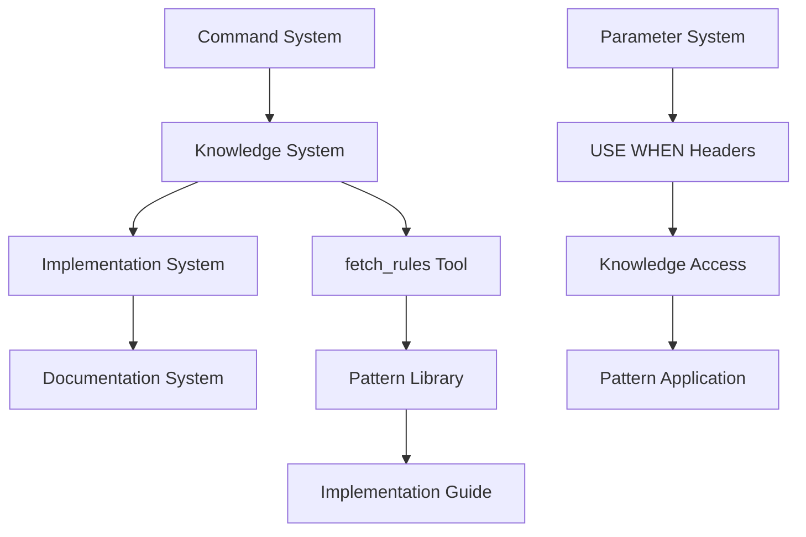
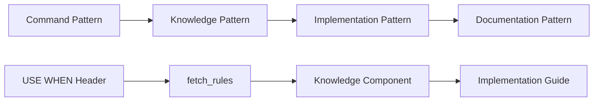

# Context Analysis: Message Command System Patterns

## Command Pattern Analysis

### 1. Mode Transition Patterns
- **Direct Mode Transition**: `plan-mode: workflow-type @template.mdc`
- **Continuation Pattern**: `continue-planning: @template.mdc`
- **Knowledge Access Pattern**: `fetch_rules(["knowledge/patterns/tool/pattern-name"])`
- **Combined Pattern**: `plan-mode: workflow-type @template.mdc @knowledge/patterns/tool/pattern-name.mdc`

### 2. Continuation Patterns
```
continue-planning: @project-rule-parameter.mdc
continue-implementation: @project-rule-parameter.mdc
```
**Pattern Components:**
- Command type (continue-planning, continue-implementation)
- Project-rule-parameter (required)

### 3. Template Creation Patterns
```
create-template: workflow-type @folder-path @planning-path project-rule-parameter
```
**Pattern Components:**
- Command type (create-template)
- Workflow type (standard-parameter)
- Folder path (standard-parameter)
- Planning path (standard-parameter)
- Template type (project-rule-parameter)

## Parameter Relationship Patterns

### 1. Standard-Parameter Relationships
1. **Workflow Type Parameters**
   - Defines the context for command execution
   - Required for mode transition commands
   - Examples: rules-workflow, front-end-workflow

2. **Path Parameters**
   - Specifies target locations
   - Used in template and file operations
   - Can be relative or absolute paths

3. **Operation Parameters**
   - Defines specific operation details
   - Used for specialized commands
   - Example: project-rule-parameter

### 2. Project-Rule-Parameter Relationships
1. **Mode-Specific Parameters**
   - plan-mode-*.mdc
   - dev-mode-*.mdc
   - Defines mode-specific behavior

2. **Template Parameters**
   - template-*.mdc
   - Defines template creation behavior
   - Can include multiple standard-parameters

3. **Continuation Parameters**
   - continue-planning-*.mdc
   - continue-implementation-*.mdc
   - Defines continuation behavior

### 3. Knowledge Access Relationships
- **Standard-Parameter Relationships**: Workflow type → Template → Knowledge
- **Project-Rule-Parameter Relationships**: Template → Implementation → Knowledge
- **Knowledge Access Relationships**: fetch_rules → Agent Requested Rules → Implementation
- **Cross-System References**: Documentation ↔ Knowledge ↔ Implementation

## Documentation Patterns

### 1. Cheatsheet Structure Pattern
```markdown
# WORKFLOW-TYPE Cheatsheet

## Core Message-Commands
| Message-Command | Standard-Parameter | Project-Rule-Parameter |
|----------------|-------------------|----------------------|
| command-type   | standard-param    | @param/type/file.mdc |
```

### 2. Parameter Definition Pattern
```markdown
# Parameter: parameter-name

## Usage
- Valid Commands: [list of commands]
- Required Parameters: [list of required]
- Optional Parameters: [list of optional]

## Relationships
- Related Parameters: [list of related]
- Incompatible Parameters: [list of incompatible]
```

### 3. Command Documentation Pattern
```markdown
# Command: command-name

## Syntax
command-name: standard-parameter @project-rule-parameter.mdc

## Parameters
- Standard Parameters: [list with descriptions]
- Project-Rule Parameters: [list with descriptions]

## Examples
[documented examples with explanations]
```

### 4. Knowledge Integration Pattern
```markdown
# Knowledge: knowledge-name

## Usage
- Valid Commands: [list of commands]
- Required Parameters: [list of required]
- Optional Parameters: [list of optional]

## Relationships
- Related Parameters: [list of related]
- Incompatible Parameters: [list of incompatible]
```

## Implementation Patterns

### 1. Parameter Detection Pattern
```powershell
# PowerShell pattern for parameter detection
$parameterPattern = "^(plan-mode|dev-mode|continue-.*): (.+)$"
if ($content -match $parameterPattern) {
    $commandType = $matches[1]
    $parameters = $matches[2]
}
```

### 2. Parameter Validation Pattern
```powershell
# PowerShell pattern for parameter validation
function Validate-Parameters {
    param (
        [string]$commandType,
        [string]$standardParam,
        [string]$projectRuleParam
    )
    # Validation logic
}
```

### 3. Documentation Generation Pattern
```powershell
# PowerShell pattern for documentation generation
function Generate-Documentation {
    param (
        [hashtable]$parameters,
        [string]$templatePath
    )
    # Generation logic
}
```

## Common Anti-Patterns to Address

### 1. Inconsistent Parameter Naming
❌ **Bad Pattern:**
```
create-template: rules-workflow @folder @planning
create-template: rules-workflow @source-path @target-path
```
✅ **Good Pattern:**
```
create-template: rules-workflow @folder-path @planning-path
create-template: rules-workflow @folder-path @planning-path
```

### 2. Mixed Parameter Types
❌ **Bad Pattern:**
```
plan-mode: rules-workflow planning-folder @template.mdc
```
✅ **Good Pattern:**
```
plan-mode: rules-workflow @planning-folder.mdc
```

### 3. Inconsistent Documentation
❌ **Bad Pattern:**
Mixing different documentation formats and structures

✅ **Good Pattern:**
Following consistent documentation templates and patterns 

## Pattern Relationships

### 1. Command-Knowledge Relationships
```
┌─────────────────┐      ┌─────────────────┐      ┌─────────────────┐
│                 │      │                 │      │                 │
│ Message Command ├─────▶│ fetch_rules    ├─────▶│ Implementation  │
│                 │      │                 │      │                 │
└─────────────────┘      └─────────────────┘      └─────────────────┘
        │                        │                        │
        │                        │                        │
        ▼                        ▼                        ▼
┌─────────────────┐      ┌─────────────────┐      ┌─────────────────┐
│                 │      │                 │      │                 │
│ Parameters      ├─────▶│ Knowledge      ├─────▶│ Documentation   │
│                 │      │                 │      │                 │
└─────────────────┘      └─────────────────┘      └─────────────────┘
```

### 2. Parameter-Knowledge Relationships
```
┌─────────────────┐      ┌─────────────────┐      ┌─────────────────┐
│                 │      │                 │      │                 │
│ USE WHEN Header ├─────▶│ fetch_rules    ├─────▶│ Knowledge       │
│                 │      │                 │      │                 │
└─────────────────┘      └─────────────────┘      └─────────────────┘
        │                        │                        │
        │                        │                        │
        ▼                        ▼                        ▼
┌─────────────────┐      ┌─────────────────┐      ┌─────────────────┐
│                 │      │                 │      │                 │
│ Parameter Def   ├─────▶│ Implementation ├─────▶│ Documentation   │
│                 │      │                 │      │                 │
└─────────────────┘      └─────────────────┘      └─────────────────┘
```

## Common Anti-Patterns

### 1. Parameter Definition Anti-Patterns
- **❌ Missing USE WHEN Headers**: Parameters without clear usage guidance
- **❌ Inconsistent Knowledge References**: Incorrect fetch_rules paths
- **❌ Incomplete Relationships**: Missing knowledge integration points
- **❌ Invalid Parameter Combinations**: Incompatible knowledge references

### 2. Implementation Anti-Patterns
- **❌ Direct Knowledge Access**: Bypassing fetch_rules tool
- **❌ Incorrect Parameter Usage**: Not following knowledge patterns
- **❌ Missing Validation**: Not checking knowledge compatibility
- **❌ Incomplete Documentation**: Not documenting knowledge integration

### 3. Documentation Anti-Patterns
- **❌ Inconsistent Headers**: Non-standard USE WHEN format
- **❌ Missing Knowledge Links**: No fetch_rules references
- **❌ Incomplete Cross-References**: Missing knowledge relationships
- **❌ Poor Pattern Documentation**: Unclear knowledge integration

## Pattern Implementation Guide

### 1. Command Pattern Implementation
```typescript
// Correct: Using fetch_rules with command
fetch_rules(["knowledge/patterns/tool/command-patterns"],
           "Understanding command patterns for implementation")

// Then implement command with knowledge
plan-mode: workflow-type @template.mdc
```

### 2. Parameter Pattern Implementation
```typescript
// Correct: Using fetch_rules for parameter knowledge
fetch_rules(["knowledge/patterns/tool/parameter-patterns"],
           "Understanding parameter patterns")

// Then implement parameter with knowledge
standard-parameter: value @knowledge-reference.mdc
```

### 3. Documentation Pattern Implementation
```typescript
// Correct: Using fetch_rules for documentation
fetch_rules(["knowledge/patterns/doc/documentation-patterns"],
           "Understanding documentation patterns")

// Then implement documentation with knowledge
# USE WHEN implementing documentation patterns
```

### 4. Knowledge Integration Pattern
```typescript
// Correct: Using fetch_rules for integration
fetch_rules(["knowledge/patterns/tool/integration-patterns"],
           "Understanding integration patterns")

// Then implement integration with knowledge
parameter-definition: value @integration-reference.mdc
```

## Pattern Validation Rules

### 1. Command Pattern Validation
- **✓ Valid**: Uses fetch_rules for knowledge access
- **✓ Valid**: Follows knowledge-based implementation
- **✓ Valid**: Integrates with documentation system
- **✓ Valid**: Uses proper cross-references

### 2. Parameter Pattern Validation
- **✓ Valid**: Has USE WHEN header matching knowledge
- **✓ Valid**: Uses fetch_rules for relationships
- **✓ Valid**: Documents knowledge integration
- **✓ Valid**: Follows parameter standards

### 3. Documentation Pattern Validation
- **✓ Valid**: Uses consistent knowledge references
- **✓ Valid**: Implements cross-reference system
- **✓ Valid**: Documents fetch_rules usage
- **✓ Valid**: Follows documentation standards

### 4. Knowledge Integration Validation
- **✓ Valid**: Uses fetch_rules correctly
- **✓ Valid**: Documents knowledge relationships
- **✓ Valid**: Implements proper patterns
- **✓ Valid**: Maintains system coherence 

## Enhanced USE WHEN Headers

### 1. Standard Format
```markdown
USE WHEN: [Primary Use Case]
KNOWLEDGE: fetch_rules(["knowledge/path"])
PATTERNS: [Related Patterns]
REQUIRES: [Dependencies]
```

### 2. Command Pattern Headers
```markdown
# Direct Mode Transition
USE WHEN: Starting a new planning or development phase
KNOWLEDGE: fetch_rules(["knowledge/patterns/tool/mode-transition"])
PATTERNS: Mode Transition, Knowledge Integration
REQUIRES: Valid workflow type, project rule parameter

# Continuation Pattern
USE WHEN: Continuing an existing workflow with new guidance
KNOWLEDGE: fetch_rules(["knowledge/patterns/tool/continuation"])
PATTERNS: Continuation, Knowledge Access
REQUIRES: Valid project rule parameter
```

### 3. Parameter Pattern Headers
```markdown
# Standard Parameter
USE WHEN: Defining core workflow components
KNOWLEDGE: fetch_rules(["knowledge/patterns/impl/parameter-standards"])
PATTERNS: Parameter Definition, Validation
REQUIRES: Valid parameter format

# Project Rule Parameter
USE WHEN: Implementing specialized behavior
KNOWLEDGE: fetch_rules(["knowledge/reference/guides/project-rule-parameter"])
PATTERNS: Rule Integration, Knowledge Access
REQUIRES: Valid .mdc file reference
```

## Enhanced Pattern Relationships

### 1. Knowledge-Command Matrix
| Command Type | Knowledge Component | Access Pattern | Implementation Guide |
|-------------|-------------------|----------------|---------------------|
| Mode Transition | knowledge/patterns/tool/mode-transition | fetch_rules | @mode-transition.mdc |
| Continuation | knowledge/patterns/tool/continuation | fetch_rules | @continuation.mdc |
| Parameter Definition | knowledge/patterns/impl/parameter-standards | fetch_rules | @parameter-def.mdc |
| Documentation | knowledge/reference/guides/documentation | fetch_rules | @documentation.mdc |

### 2. Cross-System Integration Map


### 3. Pattern Dependency Graph


## Implementation Examples

### 1. Command with Knowledge Integration
```typescript
// Mode transition with knowledge integration
plan-mode: rules-workflow @template.mdc
// USE WHEN: Starting a new rules workflow
// KNOWLEDGE: fetch_rules(["knowledge/patterns/tool/mode-transition"])
// PATTERNS: Mode Transition, Knowledge Integration
// REQUIRES: Valid workflow type, template file

// Continuation with knowledge access
continue-planning: @template.mdc
// USE WHEN: Continuing planning with new guidance
// KNOWLEDGE: fetch_rules(["knowledge/patterns/tool/continuation"])
// PATTERNS: Continuation, Knowledge Access
// REQUIRES: Valid template file
```

### 2. Parameter with Knowledge Integration
```typescript
// Standard parameter with knowledge
workflow-type: rules-workflow
// USE WHEN: Defining rules workflow context
// KNOWLEDGE: fetch_rules(["knowledge/patterns/impl/workflow-types"])
// PATTERNS: Workflow Definition, Context Setting
// REQUIRES: Valid workflow type

// Project rule parameter with knowledge
@template.mdc
// USE WHEN: Applying specialized template
// KNOWLEDGE: fetch_rules(["knowledge/reference/guides/templates"])
// PATTERNS: Template Application, Knowledge Integration
// REQUIRES: Valid template file
```

### 3. Documentation with Knowledge Integration
```typescript
// Documentation pattern with knowledge
## Implementation Guide
// USE WHEN: Documenting implementation steps
// KNOWLEDGE: fetch_rules(["knowledge/reference/guides/implementation"])
// PATTERNS: Documentation, Knowledge Integration
// REQUIRES: Valid implementation context

## Pattern Documentation
// USE WHEN: Documenting system patterns
// KNOWLEDGE: fetch_rules(["knowledge/patterns/doc/pattern-documentation"])
// PATTERNS: Pattern Documentation, Cross-References
// REQUIRES: Valid pattern context
``` 